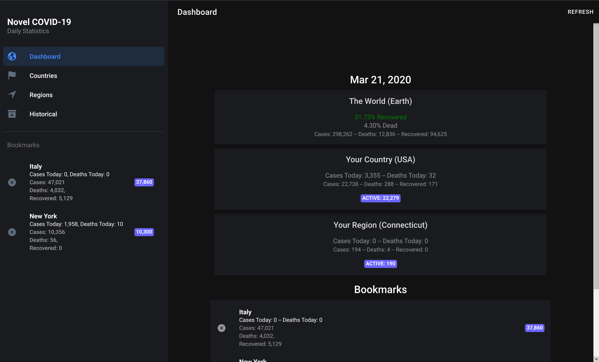

# COVID-19 Data Browser

An ionic app for browser COVID-19 data. Using https://github.com/NovelCOVID/API

## Live Site: https://live-site.d1xssd87pvtbqn.amplifyapp.com/

# Getting Started

Make sure you have Ionic installed: `npm i -g @ionic/cli` and Amplify: `npm i -g @aws-amplify/cli`

1. `git clone git@github.com:mlabieniec/covid-data`
2. cd covid-data && npm i

Setup your AWS Backend:

1. amplify init
2. amplify push
3. npm start

You can host via the Amplify Console by connecting your GitHub account/repo to Amplify Console in your AWS Account.
